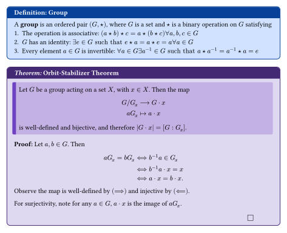
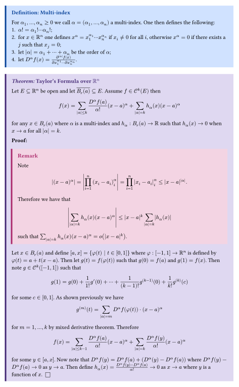
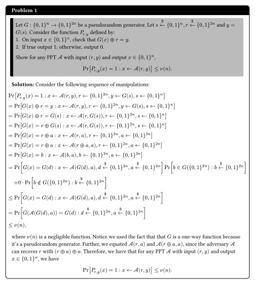
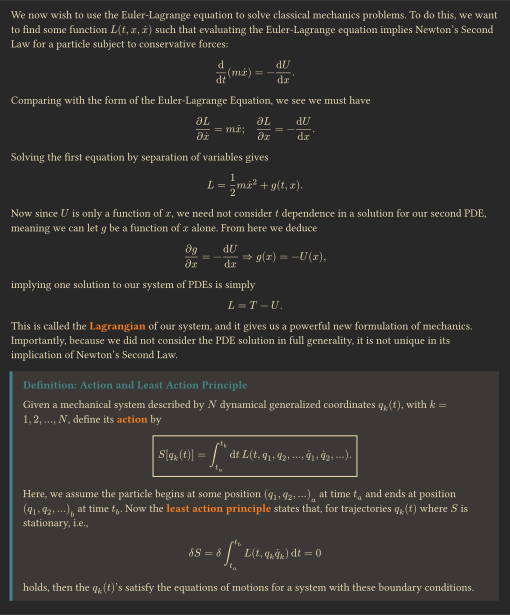
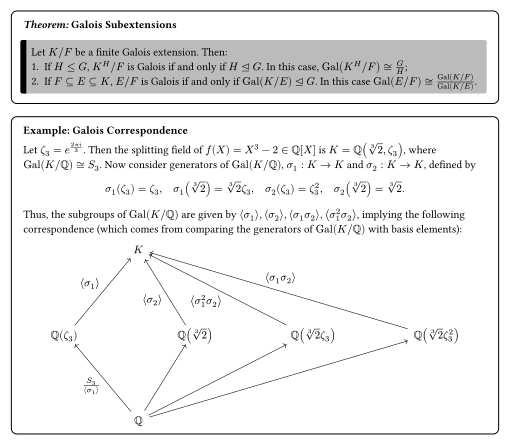
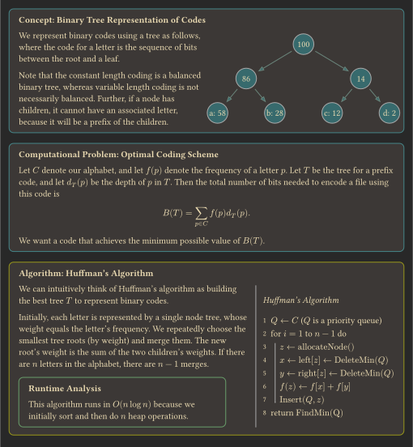

# superTheorems

**superTheorems** is a [Typst](https://github.com/typst/typst) suite of environments for taking notes and doing problem sets, especially for Mathematics, Computer Science, and Physics.

> [Typst](https://github.com/typst/typst) is required to use this package (refer to Typst's [installation page](https://github.com/typst/typst?tab=readme-ov-file#installation) here).
> For the best Typst experience, we recommend the integrated language service [`Tinymist`](https://github.com/Myriad-Dreamin/tinymist).


## Usage

To get started, add the following to your `.typ` file:

```typ
#import "@local/superTheorems:0.1.0": *

#show: thmS-init
```

### Example

<a href="examples/bootstrap_tab_orbit.typ">
    
</a>

```typ
#defn[Group][
  A *group* is an ordered pair $(G, star)$, where $G$ is a set and $star$ is a binary operation on $G$ satisfying
  1. The operation is associative: $(a star b) star c = a star (b star c) forall a, b, c in G$
  2. $G$ has an identity: $exists e in G "such that" e star a = a star e = a forall a in G$
  3. Every element $a in G$ is invertible: $forall a in G exists a^(-1) in G "such that" a star a^(-1) = a^(-1) star a = e$
]

#thm[Orbit-Stabilizer Theorem][
  Let $G$ be a group acting on a set $X$, with $x in X$.
  Then the map
  $
    G \/ G_x &--> G dot x \
    a G_x &arrow.r.bar a dot x
  $
  is well-defined and bijective, and therefore $|G dot x| = [G : G_x]$.
][
  Let $a, b in G$.
  Then
  $
    a G_x = b G_x &<==> b^(-1) a in G_x \
    &<==> b^(-1) a dot x = x \
    &<==> a dot x = b dot x.
  $
  Observe the map is well-defined by $(==>)$ and injective by $(<==)$.

  For surjectivity, note for any $a in G$, $a dot x$ is the image of $a G_x$.
]
```

### Environments

More generally, `superTheorems` has three different types of environments: _proofs_, _statements_, and _problems_.

Note the arguments are all positional but only one is required for valid syntax.
<table>
    <caption><strong>Environments</strong></caption>
    <tr>
        <td><b>Type</b></td>
        <td><b>Args (Priority)</b></td>
        <td><b>Environments</b></td>
    </tr>
    <tr>
        <td>Proof</td>
        <td>
            <ul>
                <li><code>name</code> (3)</li>
                <li><code>statement</code> (1)</li>
                <li><code>proof</code> (2)</li>
            </ul>
        </td>
        <td>
            <ul>
                <li><code>theorem</code> (<code>thm</code>)</li>
                <li><code>lemma</code> (<code>lem</code>)</li>
                <li><code>corollary</code> (<code>cor</code>)</li>
                <li><code>proposition</code> (<code>prop</code>)</li>
            </ul>
        </td>
    </tr>
    <tr>
        <td>Statement</td>
        <td>
            <ul>
                <li><code>name</code> (2)</li>
                <li><code>statement</code> (1)</li>
            </ul>
        </td>
        <td>
            <ul>
                <li><code>definition</code> (<code>defn</code>)</li>
                <li><code>remark</code> (<code>rem</code>, <code>rmk</code>)</li>
                <li><code>notation</code> (<code>notn</code>)</li>
                <li><code>example</code> (<code>ex</code>)</li>
                <li><code>concept</code> (<code>conc</code>)</li>
                <li><code>computational_problem</code> (<code>comp_prob</code>)</li>
                <li><code>algorithm</code> (<code>algo</code>)</li>
            </ul>
        </td>
    </tr>
    <tr>
        <td>Problem</td>
        <td>
            <ul>
                <li><code>name</code> (3)</li>
                <li><code>statement</code> (1)</li>
                <li><code>solution</code> (2)</li>
            </ul>
        </td>
        <td>
            <ul>
                <li><code>problem</code> (<code>prob</code>)</li>
                <li><code>exercise</code> (<code>excs</code>)</li>
            </ul>
        </td>
    </tr>
</table>

These share a set of (optional) keyword arguments:
- `breakable` (default: `false`) - whether the current environment is breakable across multiple pages.
- `width` (default: `100%`) - width of the current environment in its current scope.
- `height` (default: `auto`) - height of the current environment in its current scope.

### Themes/Colors

To customize environments, pass the following keyword arguments to `thmS-init`:
- `colors` (default: `"bootstrap"`) - Changes color scheme of environments
- `headers` (default: `"tab"`) - Changes environment box structure

<table>
    <caption><strong>Color Palettes (values for <code>colors</code>)</strong></caption>
    <tr>
        <td><code>bootstrap</code></td>
        <td><a href="src/colors/bootstrap.json"><svg viewBox="0 0 500 150" width="100%">
            <rect fill="#000000" x="0" y="0" width="50" height="100%"/>
            <rect fill="#FFFFFF" x="50" y="0" width="50" height="100%"/>
            <rect fill="#DFD8F1" x="100" y="0" width="50" height="100%"/>
            <rect fill="#FFF4CD" x="150" y="0" width="50" height="100%"/>
            <rect fill="#F1D2D5" x="200" y="0" width="50" height="100%"/>
            <rect fill="#D1E7DE" x="400" y="0" width="50" height="100%"/>
            <rect fill="#FFE5D1" x="450" y="0" width="50" height="100%"/>
            <rect fill="#D0E2FF" x="250" y="0" width="50" height="100%"/>
            <rect fill="#F3D4E3" x="300" y="0" width="50" height="100%"/>
            <rect fill="#CEE3DA" x="350" y="0" width="50" height="100%"/>
        </svg></a></td>
    </tr>
    </tr>
    <tr>
        <td><code>bw</code></td>
        <td><a href="src/colors/bw.json"><svg viewBox="0 0 500 150" width="100%">
            <rect fill="#000000" x="0" y="0" width="50" height="100%"/>
            <rect fill="#FFFFFF" x="50" y="0" width="50" height="100%"/>
            <rect fill="#FFFFFF" x="100" y="0" width="50" height="100%"/>
            <rect fill="#FFFFFF" x="150" y="0" width="50" height="100%"/>
            <rect fill="#FFFFFF" x="200" y="0" width="50" height="100%"/>
            <rect fill="#FFFFFF" x="400" y="0" width="50" height="100%"/>
            <rect fill="#FFFFFF" x="450" y="0" width="50" height="100%"/>
            <rect fill="#FFFFFF" x="250" y="0" width="50" height="100%"/>
            <rect fill="#FFFFFF" x="300" y="0" width="50" height="100%"/>
            <rect fill="#FFFFFF" x="350" y="0" width="50" height="100%"/>
        </svg></a></td>
    </tr>
    <tr>
        <td><code>gruvbox_dark</code></td>
        <td><a href="src/colors/gruvbox_dark.json"><svg viewBox="0 0 500 150" width="100%">
            <rect fill="#EBDBB2" x="0" y="0" width="50" height="100%"/>
            <rect fill="#282828" x="50" y="0" width="50" height="100%"/>
            <rect fill="#3c3836" x="100" y="0" width="50" height="100%"/>
            <rect fill="#3c3836" x="150" y="0" width="50" height="100%"/>
            <rect fill="#3c3836" x="200" y="0" width="50" height="100%"/>
            <rect fill="#3c3836" x="400" y="0" width="50" height="100%"/>
            <rect fill="#3c3836" x="450" y="0" width="50" height="100%"/>
            <rect fill="#3c3836" x="250" y="0" width="50" height="100%"/>
            <rect fill="#3c3836" x="300" y="0" width="50" height="100%"/>
            <rect fill="#3c3836" x="350" y="0" width="50" height="100%"/>
        </svg></a></td>
    </tr>
</table>

<table>
    <caption><strong>Header Styles (values for <code>headers</code>)</strong></caption>
    <tr>
        <td><code>tab</code></td>
        <td>Default header style, rounded</td>
    </tr>
    </tr>
    <tr>
        <td><code>classic</code></td>
        <td>Original header style, rounded</td>
    </tr>
    <tr>
        <td><code>sidebar</code></td>
        <td>Less padding, not rounded</td>
    </tr>
</table>


For the best outcome this function should be called before any content is rendered to enforce consistency of the documents content.
The following is a sample header:
```typ
#import "@local/superTheorems:0.1.0": *

#show: thmS-init.with(colors: "gruvbox_dark", headers: "sidebar")

// body
```

#### Extras

There are a few extra functions/macros that may be of interest:
- `correction(body)` - Add a correction to nearby content.
- `bookmark(title, info)` - Add additional information with small box.
- `equation_box(equation)` (`eqbox(equation)`) - Box an equation.
- `block_title_selector` - A selector controlling the style of the headers in the blocks.


## Examples

**`bootstrap` colorscheme with `sidebar` header style**
<a href="examples/bootstrap_sidebar_taylor.typ">
    
</a>

**`bw` colorscheme with `tab` header style**
<a href="examples/bw_tab_crypto.typ">
    
</a>

**`gruvbox_dark` colorscheme with `sidebar` header style (using by [Physica](https://github.com/Leedehai/typst-physics))**
<a href="examples/gruvbox_sidebar_lagrangian.typ">
    
</a>

**`bw` colorscheme with `classic` header style (using by [Fletcher](https://github.com/Jollywatt/typst-fletcher))**
<a href="examples/bw_classic_galoisextensions.typ">
    
</a>

**`gruvbox_dark` colorscheme with `classic` header style (using [CeTZ](https://github.com/cetz-package/cetz) and [lovelace](https://github.com/andreasKroepelin/lovelace))**
<a href="examples/gruvbox_classic_huffman.typ">
    
</a>

> Refer to the `examples/` directory for more examples.


## Local Installation

1. Clone this repository locally on your machine. 
2. Run `setup.sh` from the **root of the project directory**.
  Refer to the [Typst Packages](https://github.com/typst/packages) repository for more information.
  Note the script simply symlinks the project directory to the Typst local packages directory.

```console
$ git clone https://github.com/EsotericSquishyy/superTheorems
$ cd superTheorems
$ chmod +x setup.sh
$ ./setup.sh
```

### Testing

Test whether the installation/update worked by opening running the following commands in an empty directory:
```console
$ cat <<EOF > test.typ
#import "@local/superTheorems:{Version Number}": *
#show: thmS-init
#defn[#lorem(5)][#lorem(50)]
EOF

$ typst compile test.typ
```
The installation is working if the compile didn't fail and `test.pdf` looks like this:


## Known Issues

- Incorrect colors for arrows in drawing packages such as [Fletcher](https://github.com/Jollywatt/typst-fletcher) when using `gruvbox_dark` color scheme.


