# Ergo

**Ergo** is a [Typst](https://typst.app/) suite of customizable environments for notetaking and homework assignments, designed for students in math, CS and physics.
It is available on Typst Universe [here](https://typst.app/universe/package/ergo).

> **Typst** is required to use this package (refer to Typst's installation page [here](https://github.com/typst/typst?tab=readme-ov-file#installation)).
> For the best Typst experience, we recommend the integrated language service [Tinymist](https://github.com/Myriad-Dreamin/tinymist).

## Usage

To get started, add the following to your `.typ` file:

```typ
#import "@preview/ergo:0.2.0": *

#show: ergo-init
```

### Example

<a href="gallery/examples-typ/bootstrap-tab-orbit.typ">
    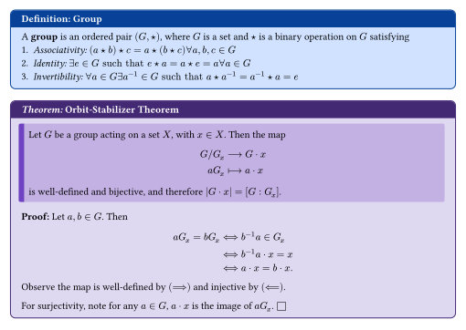
</a>

```typ
#defn[Group][
  A *group* is an ordered pair $(G, star)$, where $G$ is a set and $star$ is a binary operation on $G$ satisfying
  1. _Associativity:_ $(a star b) star c = a star (b star c) forall a, b, c in G$
  2. _Identity:_ $exists e in G "such that" e star a = a star e = a forall a in G$
  3. _Invertibility:_ $forall a in G exists a^(-1) in G "such that" a star a^(-1) = a^(-1) star a = e$
]

#thm[Orbit-Stabilizer Theorem][
  Let $G$ be a group acting on a set $X$, with $x in X$.
  Then the map
  $
    G \/ G_x &-->              G dot x \
    a G_x    &arrow.r.bar.long a dot x
  $
  is well-defined and bijective, and therefore $|G dot x| = [G : G_x]$.
][
  Let $a, b in G$.
  Then
  $
    a G_x = b G_x
    &<==> b^(-1) a in  G_x \
    &<==> b^(-1) a dot x = x \
    &<==> a dot x  = b dot x.
  $
  Observe the map is well-defined by $(==>)$ and injective by $(<==)$.

  For surjectivity, note for any $a in G$, $a dot x$ is the image of $a G_x$.
]
```

### Gallery

**Real Analysis Notes using the `bootstrap` color scheme with `sidebar` header style**
<a href="gallery/examples-typ/bootstrap-sidebar-taylor.typ">
    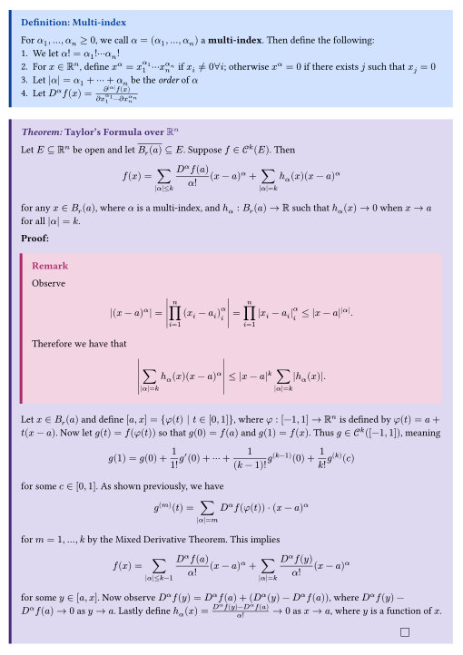
</a>

#### Cryptography Problem Set using the `bw` color scheme with `tab` header style
<a href="gallery/examples-typ/bw-tab-crypto.typ">
    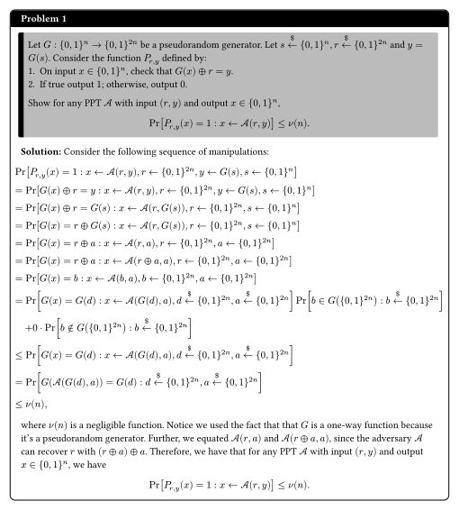
</a>

#### Classical Mechanics Notes using the `gruvbox-dark` color scheme with `sidebar` header style (with [Physica](https://github.com/Leedehai/typst-physics))

<a href="gallery/examples-typ/gruvbox-sidebar-lagrangian.typ">
    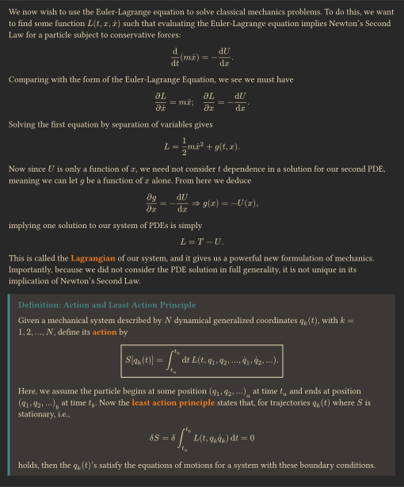
</a>

#### Abstract Algebra Notes using the `ayu-light` color scheme with `classic` header style (with [Fletcher](https://github.com/Jollywatt/typst-fletcher))

<a href="gallery/examples-typ/ayu-classic-galoisextensions.typ">
    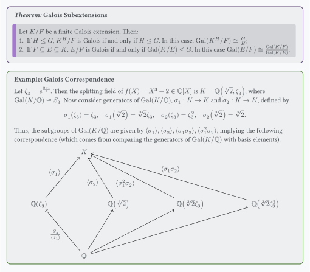
</a>

#### **Data Structures and Algorithms Notes using the `gruvbox-dark` color scheme with `classic` header style (with [CeTZ](https://github.com/cetz-package/cetz) and [Lovelace](https://github.com/andreasKroepelin/lovelace))**

<a href="gallery/examples-typ/gruvbox-classic-huffman.typ">
    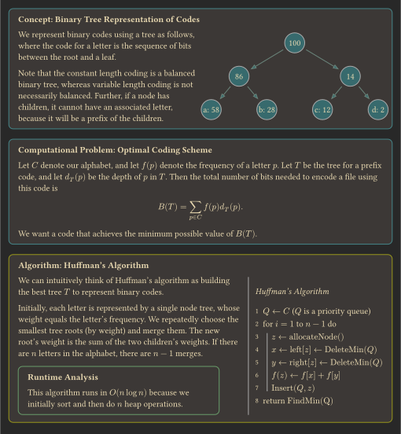
</a>

Refer to `gallery/` for more examples.

### Environments

`Ergo` has three different types of environments: _proofs_, _statements_, and _problems_.

<table>
    <tr>
        <td><b>Type</b></td>
        <td><b>Arguments</b></td>
        <td><b>Environments</b></td>
    </tr>
    <tr>
        <td>Proof</td>
        <td>
            <ol>
                <li><code>name</code></li>
                <li><code>statement</code></li>
                <li><code>proof</code></li>
            </ol>
        </td>
        <td>
            <ul>
                <li><code>theorem</code> (<code>thm</code>)</li>
                <li><code>lemma</code> (<code>lem</code>)</li>
                <li><code>corollary</code> (<code>cor</code>)</li>
                <li><code>proposition</code> (<code>prop</code>)</li>
            </ul>
        </td>
    </tr>
    <tr>
        <td>Statement</td>
        <td>
            <ol>
                <li><code>name</code></li>
                <li><code>statement</code></li>
            </ol>
        </td>
        <td>
            <ul>
                <li><code>definition</code> (<code>defn</code>)</li>
                <li><code>remark</code> (<code>rem</code>, <code>rmk</code>)</li>
                <li><code>notation</code> (<code>notn</code>)</li>
                <li><code>example</code> (<code>ex</code>)</li>
                <li><code>concept</code> (<code>conc</code>)</li>
                <li><code>computational-problem</code> (<code>comp-prob</code>)</li>
                <li><code>algorithm</code> (<code>algo</code>)</li>
                <li><code>runtime</code> </li>
                <li><code>note</code> </li>
            </ul>
        </td>
    </tr>
    <tr>
        <td>Problem</td>
        <td>
            <ol>
                <li><code>name</code></li>
                <li><code>statement</code></li>
                <li><code>solution</code></li>
            </ol>
        </td>
        <td>
            <ul>
                <li><code>problem</code> (<code>prob</code>)</li>
                <li><code>exercise</code> (<code>excs</code>)</li>
            </ul>
        </td>
    </tr>
</table>

The arguments are all positional, but `name` is optional, meaning either of these work:

```typ
// no `name` given
#theorem[ statement ][ proof ]

// `name` given
#theorem[ name ][ statement ][ proof ]
```

If you wish to state a result without giving a proof, you can leave proof as an empty content block `[]`.

All of these environments (regardless of type) share a set of (optional) keyword arguments:

- `breakable` (default: `false`) — whether the current environment is breakable across multiple pages
- `width` (default: `100%`) — width of the current environment in its scope
- `height` (default: `auto`) — height of the current environment in its scope

Also, the `problem` environment includes an automatic counter if no title is passed in, which can be helpful when working on homework assignments.

### Themes and Colors


To modify themes and colors, use the `ergo-init` function:

```typ
#import "@preview/ergo:0.2.0": *

#show: ergo-init.with(
    colors: ergo-colors.gruvbox-dark,
    headers: ergo-colors.sidebar,
    all-breakable: true,
    inline-qed: true,
    prob-nums: false,
)
```

The modifiable parameters are:

- `colors` (default: `ergo-colors.bootstrap`) — colors of theme (refer to **Color Palettes** table for valid arguments)
- `headers` (default: `"tab"`) — header style of theme (refer to **Header Styles** table for valid arguments)
- `all-breakable` (default: `false`) — the default value for `breakable` environment parameter
- `inline-qed` (default: `false`) — whether the Q.E.D square is inline or right aligned in proof environments
- `prob-nums` (default: `true`) — whether excercise and problem environments have a numbering system

<table>
    <caption><strong>Color Palettes (values for <code>colors</code>)</strong></caption>
    <tr>
        <td><code>ergo-colors.bootstrap</code> (light)</td>
        <td>
            Color scheme adapted from the CSS framework <a href="https://getbootstrap.com/">Bootstrap</a>
        </td>
        <td>
            No preview available
        </td>
    </tr>
    <tr>
        <td><code>ergo-colors.bw</code> (light)</td>
        <td>
            Monochrome black and white scheme
        </td>
        <td>
            No preview available
        </td>
    </tr>
    <tr>
        <td><code>ergo-colors.equilibrium-gray-light</code> (light)</td>
        <td>
            From the Equilibrium Gray Light <code>vim</code> color scheme by Carlo Abelli
        </td>
        <td>
            <a href="src/color/equilibrium-gray-light.json">
                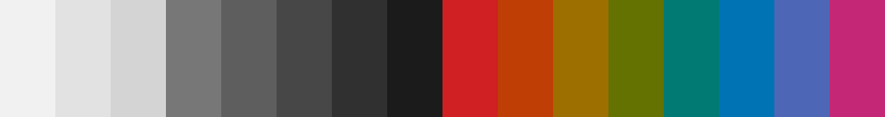
            </a>
        </td>
    </tr>
    <tr>
        <td><code>ergo-colors.penumbra-light</code> (light)</td>
        <td>
            From the Penumbra Light <code>vim</code> color scheme by Zachary Weiss
        </td>
        <td>
            <a href="src/color/penumbra-light.json">
                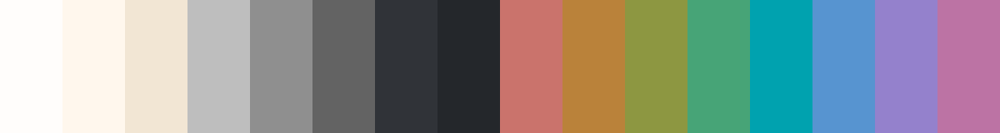
            </a>
        </td>
    </tr>
    <tr>
        <td><code>ergo-colors.primer-light</code> (light)</td>
        <td>
            From the Primer Light <code>vim</code> color scheme by Jimmy Lin
        </td>
        <td>
            <a href="src/color/primer-light.json">
                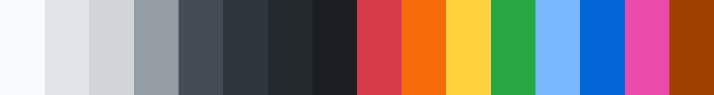
            </a>
        </td>
    </tr>
    <tr>
        <td><code>ergo-colors.measured-light</code> (light)</td>
        <td>
            From the Measured Light <code>vim</code> color scheme by Measured
        </td>
        <td>
            <a href="src/color/measured-light.json">
                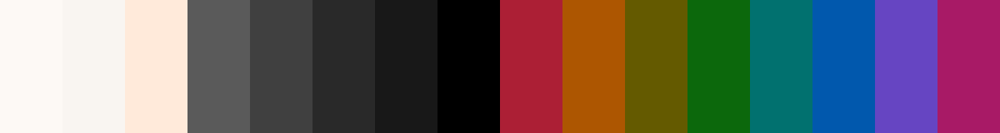
            </a>
        </td>
    </tr>
    <tr>
        <td><code>ergo-colors.terracotta</code> (light)</td>
        <td>
            From the Terracotta <code>vim</code> color scheme by Alexander Rossell Hayes
        </td>
        <td>
            <a href="src/color/terracotta.json">
                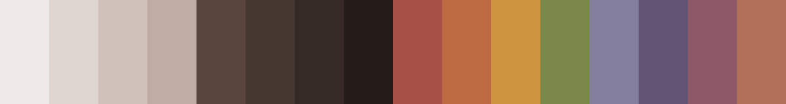
            </a>
        </td>
    </tr>
    <tr>
        <td><code>ergo-colors.dracula</code> (dark)</td>
        <td>
            Adapted from <a href="https://draculatheme.com/">dracula</a>
        </td>
        <td>
            <a href="src/color/dracula.json">
                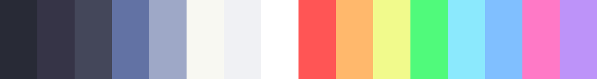
            </a>
        </td>
    </tr>
    <tr>
        <td><code>ergo-colors.gruvbox-dark-medium</code> (dark)</td>
        <td>
            Adapted from the dark version of the famous <code>vim</code> color scheme <a href="https://github.com/morhetz/gruvbox">gruvbox</a>
        </td>
        <td>
            <a href="src/color/gruvbox-dark-medium.json">
                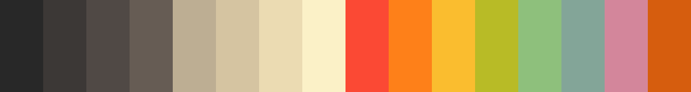
            </a>
        </td>
    </tr>
    <tr>
        <td><code>ergo-colors.eighties</code> (dark)</td>
        <td>
            From the Eighties <code>vim</code> color scheme by Chris Kempson
        </td>
        <td>
            <a href="src/color/eighties.json">
                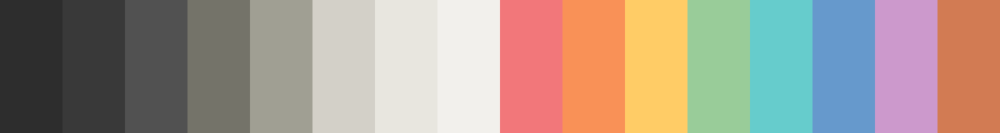
            </a>
        </td>
    </tr>
    <tr>
        <td><code>ergo-colors.lime</code> (dark)</td>
        <td>
            From the Lime <code>vim</code> color scheme by limelier
        </td>
        <td>
            <a href="src/color/lime.json">
                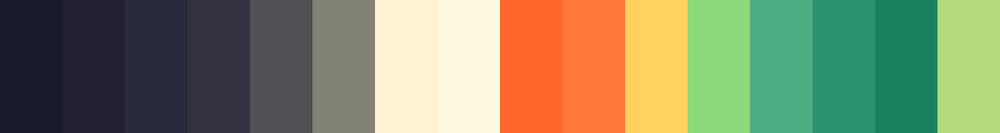
            </a>
        </td>
    </tr>
    <tr>
        <td><code>ergo-colors.woodland</code> (dark)</td>
        <td>
            From the Woodland <code>vim</code> color scheme by Jay Cornwall
        </td>
        <td>
            <a href="src/color/woodland.json">
                
            </a>
        </td>
    </tr>
</table>

<table>
    <caption><strong>Header Styles (values for <code>headers</code>)</strong></caption>
    <tr>
        <td><code>tab</code></td>
        <td>Default header style, rounded</td>
    </tr>
    </tr>
    <tr>
        <td><code>classic</code></td>
        <td>Original header style, rounded</td>
    </tr>
    <tr>
        <td><code>sidebar</code></td>
        <td>Less padding, not rounded</td>
    </tr>
</table>

This function should be called before any content is rendered to enforce consistency of the document content.

#### Custom Color Schemes

You can also define your own color scheme.
To do this, define a Typst `dictionary` with the valid fields and pass it in to the `ergo-init` function
The best way to do this is to define your scheme in `json`:

```typ
#import "@preview/ergo:0.2.0": *

#let my-custom-colors = json("my-custom-colors.json")
#show: ergo-init.with(colors: my-custom-colors)
```

Refer to existing color schemes in `src/color/` for information on valid fields.
We support RGB and RGBA in hex format (i.e. `"#ffffff"` or `"#ffffffff"`).
Note that you can use our Python project to automatically generate ergo themes from arbitrary Base 16 color schemes like those found on [Tinted Gallery](https://tinted-theming.github.io/tinted-gallery/).

#### Extras

There are a few extra functions and macros that may be of interest:

- `correction(body)` — Content with red text, useful for correcting a previous assignment
- `bookmark(title, info)` — Add additional information with small box. Particularly useful for recording dates and times
- `equation-box(equation)` (`eqbox(equation)`) — Box an equation
- `ergo-title-selector` — A selector controlling the style of the headers in the blocks

## Local Installation (MacOS / Linux)

1. Clone this repository locally on your machine.
2. Run `setup.sh` from the **root of the project directory**.
  This script symlinks the project directory to the Typst local packages directory.
  Refer to the [Typst Packages](https://github.com/typst/packages) repository for more information.

```console
$ git clone https://github.com/EsotericSquishyy/ergo
$ cd ergo
$ chmod +x setup.sh
$ ./setup.sh
```

### Testing

Test whether the installation worked by running the following commands in an empty directory:

```console
$ cat <<EOF > test.typ
#import "@preview/ergo:0.2.0": *
#show: ergo-init
#defn[#lorem(5)][#lorem(50)]
EOF

$ typst compile test.typ
```

The installation is successful if the file compiled without errors and `test.pdf` looks like this:

