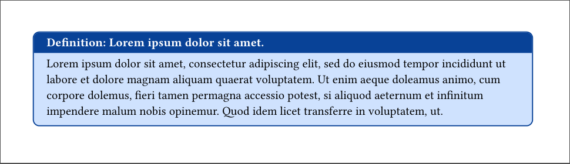

# superTheorems

**superTheorems** is a [Typst](https://github.com/typst/typst) suite of environments for taking notes and doing problem sets, especially for Mathematics, Computer Science, and Physics.

> [Typst](https://github.com/typst/typst) is required to use this package (refer to Typst's [installation page](https://github.com/typst/typst?tab=readme-ov-file#installation) here).
> For the best Typst experience, we recommend the integrated language service [`Tinymist`](https://github.com/Myriad-Dreamin/tinymist).


## Usage

To get started, add the following to your `.typ` file:

```typ
#import "@local/superTheorems:0.1.0": *

#show: thmS-init.with()
```

Then the default _definition_ and _theorem_ environments can be constructed as follows:

```typ
#defn[Group][
  A *group* is an ordered pair $(G, star)$, where $G$ is a set and $star$ is a binary operation on $G$ satisfying
  1. The operation is associative: $(a star b) star c = a star (b star c) forall a, b, c in G$
  2. $G$ has an identity: $exists e in G "such that" e star a = a star e = a forall a in G$
  3. Every element $a in G$ is invertible: $forall a in G exists a^(-1) in G "such that" a star a^(-1) = a^(-1) star a = e$
]

#thm[Orbit-Stabilizer Theorem][
  Let $G$ be a group acting on a set $X$, with $x in X$.
  Then the map
  $
    G \/ G_x &--> G dot x \
    a G_x &arrow.r.bar a dot x
  $
  is well-defined and bijective, and therefore $|G dot x| = [G : G_x]$.
][
  Let $a, b in G$.
  Then
  $
    a G_x = b G_x &<==> b^(-1) a in G_x \
    &<==> b^(-1) a dot x = x \
    &<==> a dot x = b dot x.
  $
  Observe the map is well-defined by $(==>)$ and injective by $(<==)$.

  For surjectivity, note for any $a in G$, $a dot x$ is the image of $a G_x$.
]
```

<!--There should be an image here - first we need to fix the bug where thm title is not vertically centered -->

### Environments

More generally, `superTheorems` has three different types of environments: _proofs_, _statements_, and _problems_.

Note the arguments are all positional but only one is required for valid syntax.
<table>
  <tr>
    <td><b>Type</b></td>
    <td><b>Args (Priority)</b></td>
    <td><b>Environments</b></td>
    <td><b>Notes</b></td>
  </tr>

  <tr>
    <td>Proof</td>
    <td>
        <ul>
            <li><code>name</code> (3)</li>
            <li><code>statement</code> (1)</li>
            <li><code>proof</code> (2)</li>
        </ul>
    </td>
    <td>
        <ul>
            <li><code>theorem</code> (<code>thm</code>)</li>
            <li><code>lemma</code> (<code>lem</code>)</li>
            <li><code>corollary</code> (<code>cor</code>)</li>
            <li><code>proposition</code> (<code>prop</code>)</li>
        </ul>
    </td>
    <td>
    </td>
  </tr>

  <tr>
    <td>Statement</td>
    <td>
        <ul>
            <li><code>name</code> (2)</li>
            <li><code>statement</code> (1)</li>
        </ul>
    </td>
    <td>
        <ul>
            <li><code>definition</code> (<code>defn</code>)</li>
            <li><code>remark</code> (<code>rem</code>, <code>rmk</code>)</li>
            <li><code>notation</code> (<code>notn</code>)</li>
            <li><code>example</code> (<code>ex</code>)</li>
            <li><code>concept</code> (<code>conc</code>)</li>
            <li><code>computational_problem</code> (<code>comp_prob</code>)</li>
            <li><code>algorithm</code> (<code>algo</code>)</li>
        </ul>
    </td>
    <td>
    </td>
  </tr>

  <tr>
    <td>Problem</td>
    <td>
        <ul>
            <li><code>name</code> (3)</li>
            <li><code>statement</code> (1)</li>
            <li><code>solution</code> (2)</li>
        </ul>
    </td>
    <td>
        <ul>
            <li><code>problem</code> (<code>prob</code>)</li>
            <li><code>exercise</code> (<code>excs</code>)</li>
        </ul>
    </td>
    <td>
        <ul>
            <li>Has built in counter</li>
        </ul>
    </td>
  </tr>
</table>

These share a set of (optional) keyword arguments:
- `breakable` (default: `false`) - whether the current environment is breakable across multiple pages.
- `width` (default: `100%`) - width of the current environment in its current scope.
- `height` (default: `auto`) - height of the current environment in its current scope.

### Themes/Colors

To customize environments, pass the following keyword arguments to `thmS-init`:
- `colors` (default: `"bootstrap"`) - Changes color scheme of environments
    - `"classic"` - Original
    - `"bw"` - Black and white
    - `"bootstrap"` - Default color scheme based on bootstrap colors
    - `"gruvbox_dark"` - Gruvbox Dark color scheme, also modifies the background color
- `headers` (default: `"tab"`) - Changes environment box structure
    - `"tab"` - Default header style, rounded
    - `"classic"` - Original header style, rounded
    - `"sidebar"` - Less padding, not rounded

For the best outcome this function should be called before any content is rendered to enforce consistency of the documents content.
The following is a sample header:
```typ
#import "@local/superTheorems:0.1.0": *
#show: thmS-init.with(colors: "gruvbox_dark", headers: "sidebar")
// body
```

#### Extras

There are a few extra functions/macros that may be of interest:
- `correction(body)` - Add a correction to nearby content.
- `bookmark(title, info)` - Add additional information with small box.
- `equation_box(equation)` - Box an equation.
- `proof(body)` - Prepend body with "Proof:" and append `qed`.
- `qed` - A macro for `sym.square.big` with additional spacing.


## Examples

Refer to the `examples/` directory to get an idea of how to work with the package.


## Local Installation

1. Clone this repository locally on your machine. 
2. Run `setup.sh` from the **root of the project directory**.
  Refer to the [Typst Packages](https://github.com/typst/packages) repository for more information.
  Note the script simply symlinks the project directory to the Typst local packages directory.

```bash
git clone https://github.com/EsotericSquishyy/superTheorems
cd superTheorems
chmod +x setup.sh
./setup.sh
```

### Testing

Test whether the installation/update worked by opening running the following commands in an empty directory:
```bash
cat <<EOF > test.typ
#import "@local/superTheorems:{Version Number}": *
#defn[
    #lorem(5)
][
    #lorem(50)
]
EOF

typst compile test.typ
```
The installation is working if the compile didn't fail and `test.pdf` looks like this:


### Updating package

If you want to use a different version of the package than the one currently installed you can do one of the following:
- **To keep previous version:** Clone this repository a second time (in a different directory) and run `scripts/setup.sh` in the new repository's root directory.
Note this will remove the any previous verion's symlink that has the same version number as the one you are installing.
- **To remove previous version:** Pull the changes from the target release/commit and rerun `scripts/setup.sh` from the root of the project directory.
Optionally, you can remove the dangling symlink from the Typst local package directory.


## Known Issues
- Incorrect colors for arrows in drawing packages such as [Fletcher](https://github.com/Jollywatt/typst-fletcher) when using `gruvbox_dark` color scheme.

